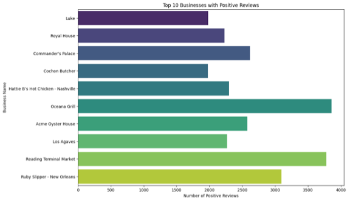
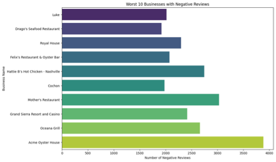
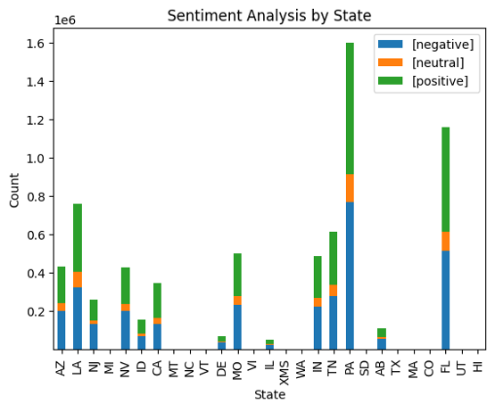
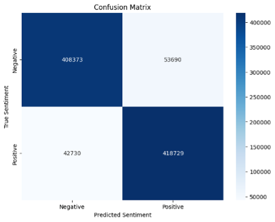

# Yelp Sentiment Analysis with Apache Spark and Spark NLP

## Overview

This project aims to perform sentiment analysis on Yelp reviews using Apache Spark and Spark NLP. The project includes two main scripts:

1. **spark_nlp_sentiment_analysis.py**: Utilizes pre-trained models from Spark NLP for sentiment analysis.
2. **yelp_sentiment_analysis_pipeline.py**: Implements a custom sentiment analysis pipeline using various NLP techniques and machine learning models.

## Project Files

There is no direct dependency between the two scripts. Each script is designed to perform sentiment analysis independently using different approaches and techniques. Here is a brief overview of each script's functionality:

1. `spark_nlp_sentiment_analysis.py`:
   - Uses pre-trained models from Spark NLP for sentiment analysis.
   - Loads and preprocesses Yelp review data.
   - Applies the Universal Sentence Encoder and SentimentDLModel for sentiment analysis.
   - Evaluates the model performance using the F1 score.
   - Identifies the top 10 most positive and negative businesses based on review sentiments.
1. `yelp_sentiment_analysis_pipeline.py`:
   - Implements a custom sentiment analysis pipeline using PySpark.
   - Loads and preprocesses Yelp review and business data.
   - Performs text preprocessing including tokenization, stop words removal, and lemmatization.
   - Uses CountVectorizer and TF-IDF for feature extraction.
   - Trains a Linear Support Vector Classifier (SVC) model with cross-validation.
   - Evaluates the model performance using the F1 score.
   - Handles class imbalance through undersampling.

## Getting Started

### Prerequisites

- Apache Spark
- Spark NLP
- PySpark

### Installation

1. Clone the repository:

```bash
git clone https://github.com/pathak-ashutosh/sentiment-analysis-yelp-reviews.git
cd sentiment-analysis-yelp-reviews
```

1. Install the required Python packages:

```bash
pip install pyspark sparknlp
```

### Running the Scripts

1. **spark_nlp_sentiment_analysis.py**:

```bash
spark-submit spark_nlp_sentiment_analysis.py
```

2. **yelp_sentiment_analysis_pipeline.py**:

```bash
spark-submit yelp_sentiment_analysis_pipeline.py
```

## Project Structure

- **spark_nlp_sentiment_analysis.py**: Script for sentiment analysis using pre-trained Spark NLP models.
- **yelp_sentiment_analysis_pipeline.py**: Script for custom sentiment analysis pipeline using PySpark.

### Running Order

Since there is no dependency between the scripts, you can run them in any order. Each script is self-contained and does not rely on the output or results of the other script. You can choose to run either script first based on your preference or the specific analysis you are interested in:

- If you want to use pre-trained models for a quick sentiment analysis, run `spark_nlp_sentiment_analysis.py` first.
- If you are interested in building and evaluating a custom sentiment analysis pipeline, run `yelp_sentiment_analysis_pipeline.py` first.

## Results and Analysis

### Spark NLP Sentiment Analysis

Using the Spark NLP pre-trained model, we performed sentiment analysis on Yelp reviews. The steps and results are as follows:

1. **Model and Data Processing**:
   - Utilized the Universal Sentence Encoder and SentimentDLModel for sentiment analysis.
   - Converted star ratings to sentiment labels: 1-2 stars as negative, 2.5-3.5 stars as neutral, and 4-5 stars as positive.

2. **Evaluation**:
   - Compared the predicted sentiments with the actual star ratings.
   - Achieved an F1 score of **0.69**.

3. **Business Sentiment Analysis**:
   - Identified the top 10 most positive and negative businesses based on review sentiments.
   - Plotted graphs to visualize the sentiment distribution across different states.
    
    
    

### Linear SVC Sentiment Analysis Pipeline

Using a custom sentiment analysis pipeline with PySpark, we built and evaluated a Linear Support Vector Classifier (SVC) model. The steps and results are as follows:

1. **Data Preprocessing**:
   - Converted text to lowercase, handled contractions, and removed non-alphabetic characters.
   - Tokenized text and removed stop words.
   - Encoded sentiments: 1-3 stars as negative (0) and 3.5-5 stars as positive (1).

2. **Feature Engineering**:
   - Applied CountVectorizer and TF-IDF for feature extraction.
   - TF-IDF provided better results with an F1 score of **0.89** compared to **0.53** from CountVectorizer.

3. **Undersampling**:
   - Balanced the dataset by undersampling the majority class.
   - Ensured equal representation of positive and negative sentiments.

4. **Model Training and Evaluation**:
   - Trained the Linear SVC model with cross-validation.
   - Best parameters for TF-IDF:
     - `regParam`: 0.01
     - `maxIter`: 100
   - Achieved an F1 score of **0.8955** on the validation set.

5. **Confusion Matrix**:
   - The model showed a high number of True Positives and True Negatives, indicating strong classification performance.
   - Some False Positives and False Negatives were observed, suggesting room for improvement with further hyperparameter tuning.
    

### Summary

- **Spark NLP Model**: Achieved an F1 score of **0.69**.
- **Linear SVC Model with TF-IDF**: Achieved an F1 score of **0.8955**.
- **Top Positive and Negative Businesses**: Identified and visualized based on review sentiments.
- **State-wise Sentiment Distribution**: Analyzed and plotted for better insights.

The results demonstrate the effectiveness of both pre-trained models and custom-built pipelines in performing sentiment analysis on large-scale datasets. The Linear SVC model with TF-IDF vectorization showed superior performance, highlighting the importance of feature engineering and model tuning in sentiment classification tasks.

## Contributing

Contributions are welcome! Please open an issue or submit a pull request for any improvements or bug fixes.

## License

This project is licensed under the MIT License. See the [LICENSE](LICENSE) file for details.

## Acknowledgments

- [Apache Spark](https://spark.apache.org/)
- [Spark NLP](https://nlp.johnsnowlabs.com/)